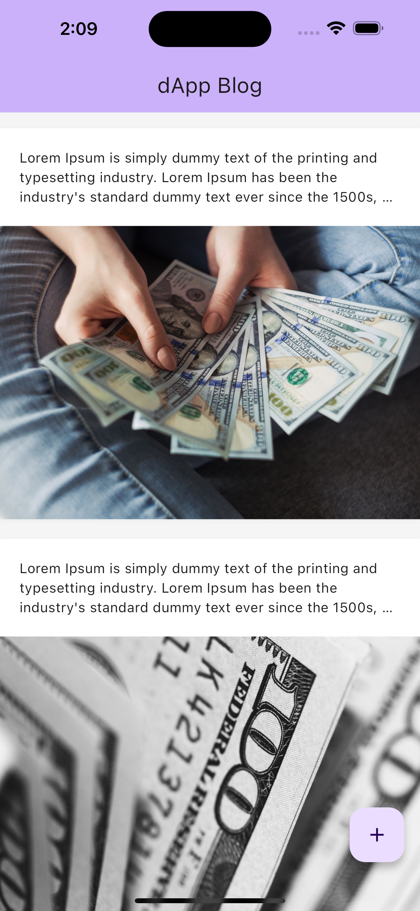
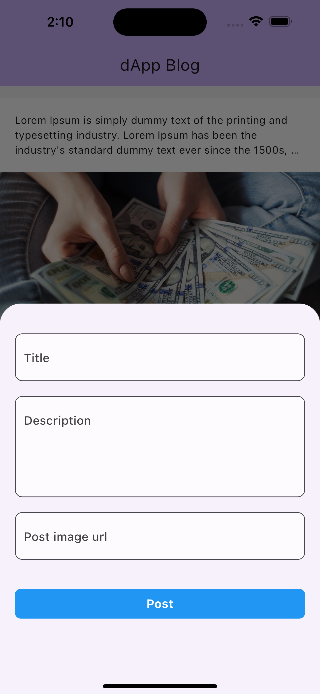

# dapp_blog

A dApp Blog

This decentralized App is built with Flutter and Solidity

## Features

- Create post
- View all posts
- Update posts
- Delete post

<br>

## Screenshots

### Home and Create Post

&nbsp;&nbsp;&nbsp;&nbsp;&nbsp;&nbsp;&nbsp;&nbsp;

## ✨ Requirements

- Any Operating System (ie. MacOS X, Linux, Windows)
- Any IDE with Flutter SDK installed (ie. Android Studio, VSCode, IntelliJ, etc)
- A little knowledge of Dart and Flutter


## Run Locally

Rename ._env file inside the root directory to .env and provide the details below.
```bash
    INFURA_API_KEY = 
    CONTRACT_ADDRESS = 
    PRIVATE_KEY =
```

Run the App

```bash
  git clone https://github.com/lexican/flutter_dapp_blog.git
  cd flutter_dapp_blog
  flutter pub get
  flutter run
```
